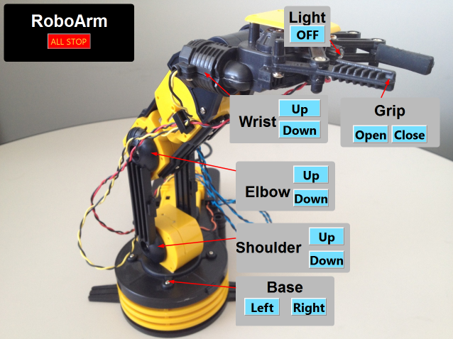

.. index:: EPICS clients; CSS BOY

==============
CSS BOY client
==============

   
   CSS BOY control screen

Basic controls of the robot axes and LED are provided
by buttons on the CSS BOY screen.  Each action will happen
as long as the button is held down.
