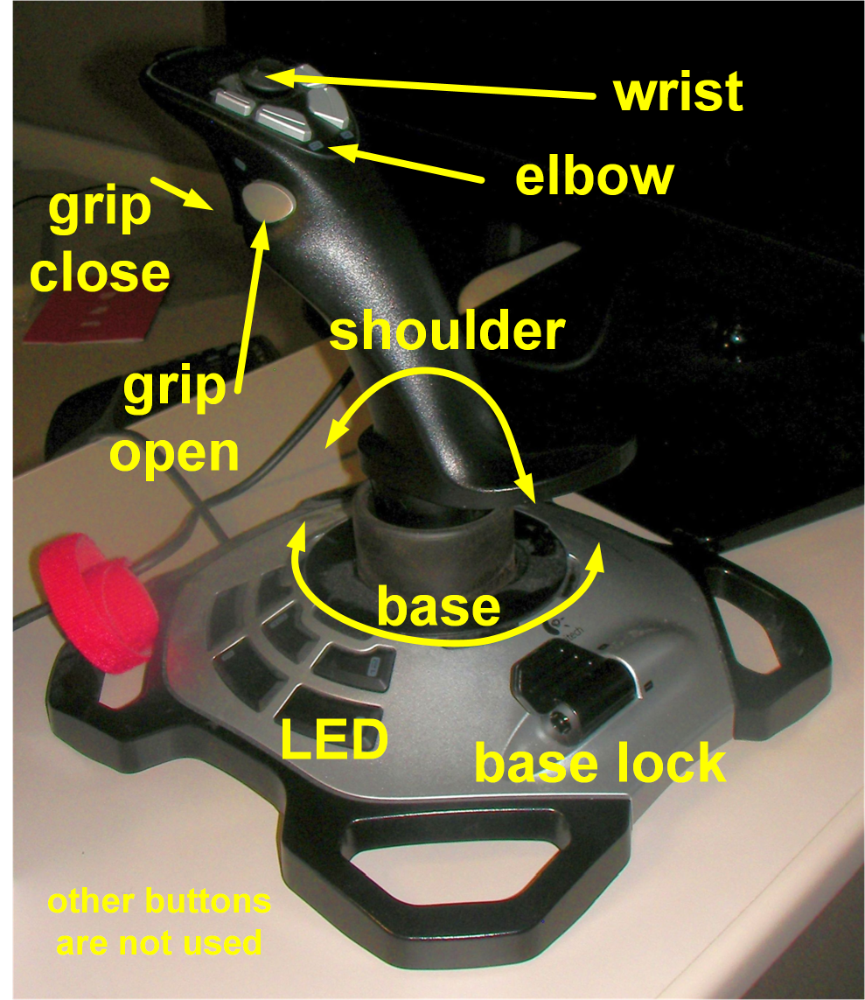

.. index:: joystick
.. index:: EPICS clients; joystick

.. _joystick:

============================================
Joystick - IOC support (not really a client)
============================================

The joystick is an operator interface.
Controls for this interface have been implemented here within the IOC.

Keenan Lang, APS BCDA group, had developed an HMI (human-machine interface)
module to allow human-machine
interface devices such as mice, keyboards, and joysticks (and other) to
communicate directly into an EPICS IOC.  In a few hours, he added that
support to the robot IOC project so that a particular joystick can be used
to control the robot arm directly within the IOC.

With added joystick control in the IOC, it is not necessary to require a 
KVM GUI (video screen + keyboard + mouse) to operate the robot.

   
   This is the joystick we will use.
   (model: Logitech Extreme 3D Pro)
   It is right-handed and has a twist action (vertical axis).  
   We'll use that for the base rotation.

========  ================================================================
button    action
========  ================================================================
trigger   close grip
thumb     open grip
twist     rotate base in same direction
lever     turns on/off base rotation (useful when trying to grasp objects)
joystick  shoulder axis: forward=down, back=up
elbow     two buttons, forward and back
wrist     knob, forward=down, back=up
========  ================================================================

The joystick buttons are described in file:

* ``edgeRoboArmIOC/support/usb-1-0/usbApp/Db/LogitechExtreme3DPro.in``

The actions are mapped to buttons in a database file:

* ``edgeRoboArmIOC/support/xxx-5-6/xxxApp/Db/roboArm.db``
* (includes all of ``edgeRoboArmIOC/support/ip-2-13/ipApp/Db/roboArm.db``)

.. compound::

   .. rubric:: EPICS IOC startup commands to support the joystick.
   
   .. code-block:: c
      :linenos:

      usbCreateDriver("JOYSTICK", "$(USB)/usbApp/Db/LogitechExtreme3DPro.in")
      usbConnectDevice("JOYSTICK", 0, 0x046D, 0xC215)
      dbLoadRecords("../../xxxApp/Db/roboArm.db", "P=xxx:, A=A1:, INPORT=JOYSTICK, OUTPORT=USB1")

The database provides the mapping between EPICS records and joystick buttons.

.. compound::

   .. rubric:: The joystick grip buttons are mapped in a *calcout* record.
   
   .. code-block:: c
      :linenos:

      record(calcout, "$(P)$(A)grip_calc")
      {
         field(INPA, "$(P)$(A)Trigger_State.VAL NPP")
         field(INPB, "$(P)$(A)LButton_State.VAL NPP")
         field(CALC, "2 * B + A")
         field(OUT, "$(P)$(A)grip_move PP")
      }
      record(bi, "$(P)$(A)Trigger_State")
      {
         field(DTYP, "asynInt32")
         field(SCAN, "I/O Intr")
         field(INP, "@asyn($(INPORT), 0, 0)TRIGGER_PRESSED")
         field(FLNK, "$(P)$(A)grip_calc")
      }
      record(bi, "$(P)$(A)LButton_State")
      {
         field(DTYP, "asynInt32")
         field(SCAN, "I/O Intr")
         field(INP, "@asyn($(INPORT), 0, 0)LBUTTON_PRESSED")
         field(FLNK, "$(P)$(A)grip_calc")
      }

.. note:: To use a different joystick, you'll need to create
   a new file todescribe the buttons on the joystick and the values
   used by USB communications: ``$(USB)/usbApp/Db/<new_joystick>.in``
   
   Then, you'll need to modify the ``../../xxxApp/Db/roboArm.db`` file
   for the names of the new buttons.  You might also need to update the 
   calculation logic in the database to match your new joystick.
