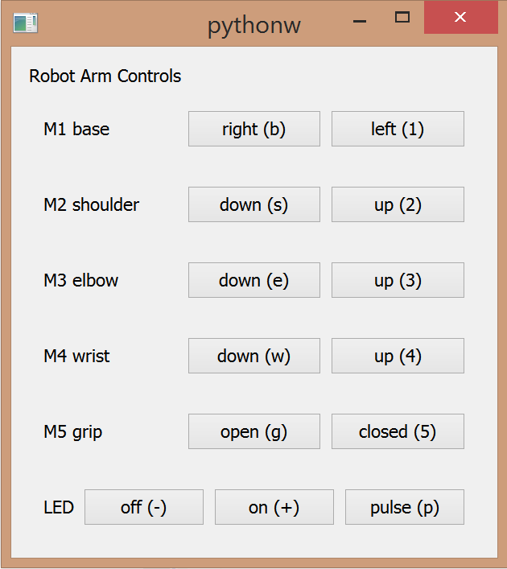

.. index:: EPICS clients; Python

=================================
Python - PyEpics and PyQt4 client
=================================

A Python Graphical User Interface client (using PyEpics and PyQt4)
was created to provide a button interface to the robot controls.
This was especially useful since the hand-held controller broke.

   
   The Python Graphical User Interface.

The GUI screen is rather basic, it provides buttons for all robot arm actions.
Additional keyboard equivalents were assigned.  With the key press bindings,
it was then possible to control more than one axis of the robot arm at the same time.
The success of any multitouch interface to this robot is limited by available battery power.

The control is provided in two Python modules:

:robot.py: interfaces with EPICS, converts move commands to PVs, provides basic workout, no GUI
:gui_robot.py: interfaces with *robot* module, provides the GUI

source code documentation
-------------------------

Source code of the Python client is provided below.

gui_robot
+++++++++

.. automodule:: gui_robot
   :members:
   :undoc-members:
   :show-inheritance:

robot
+++++

.. automodule:: robot
   :members:
   :undoc-members:
   :show-inheritance:
