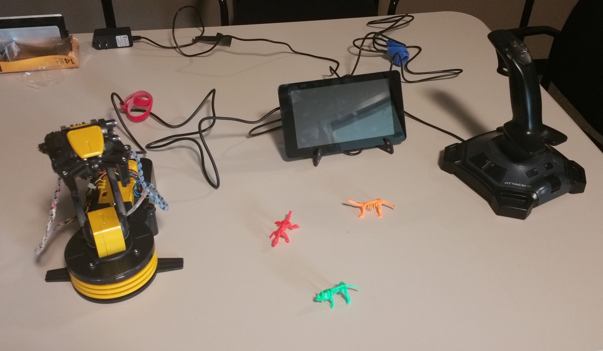
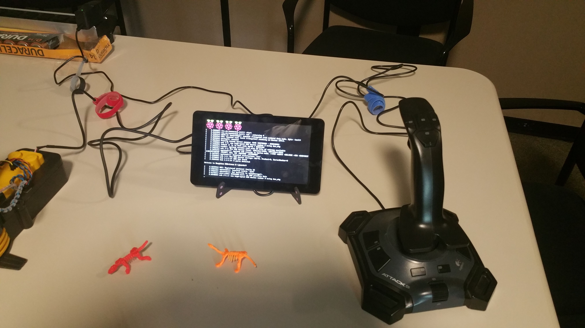
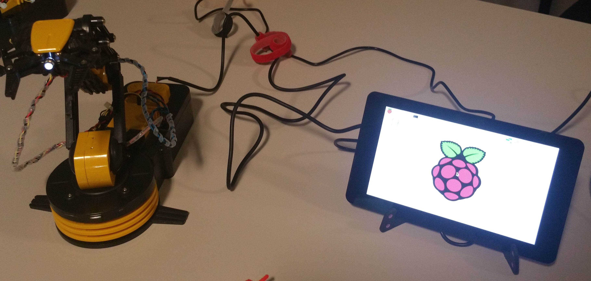
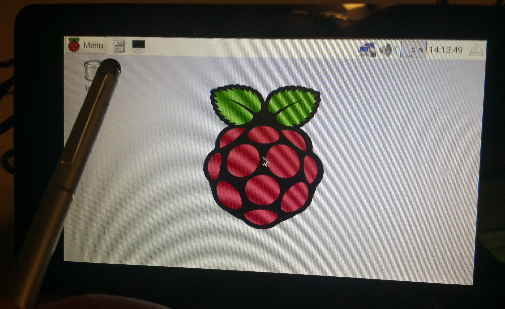
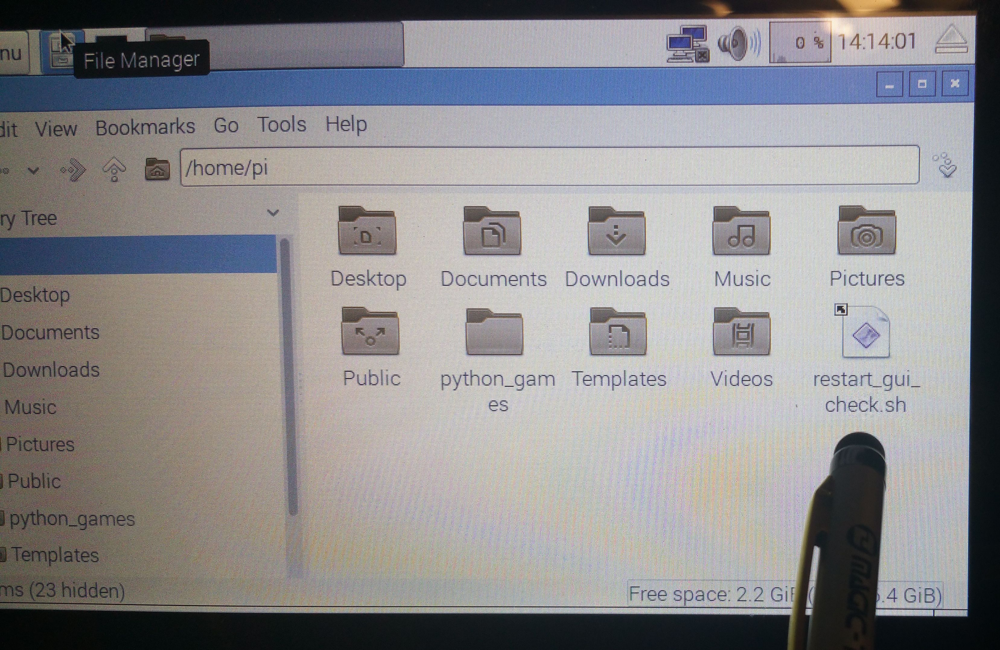
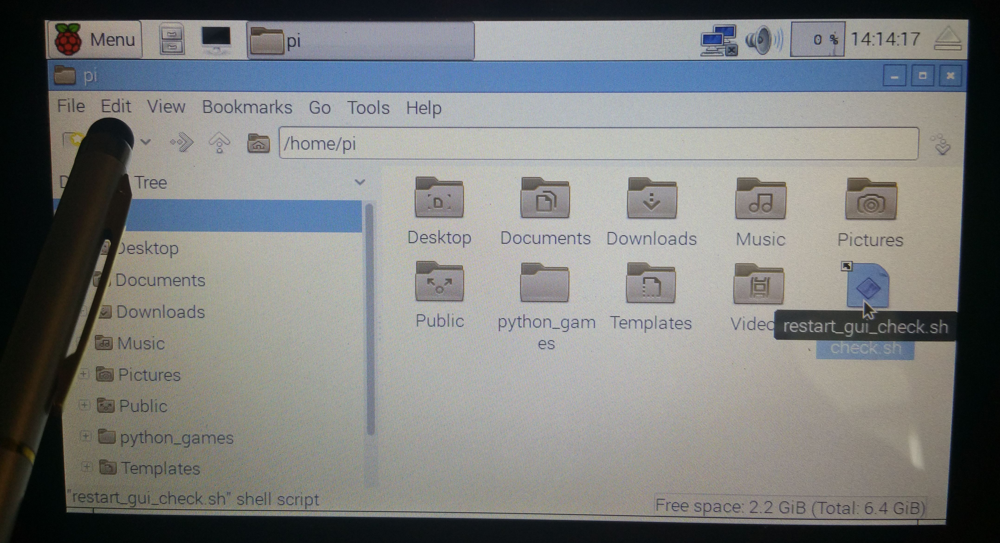
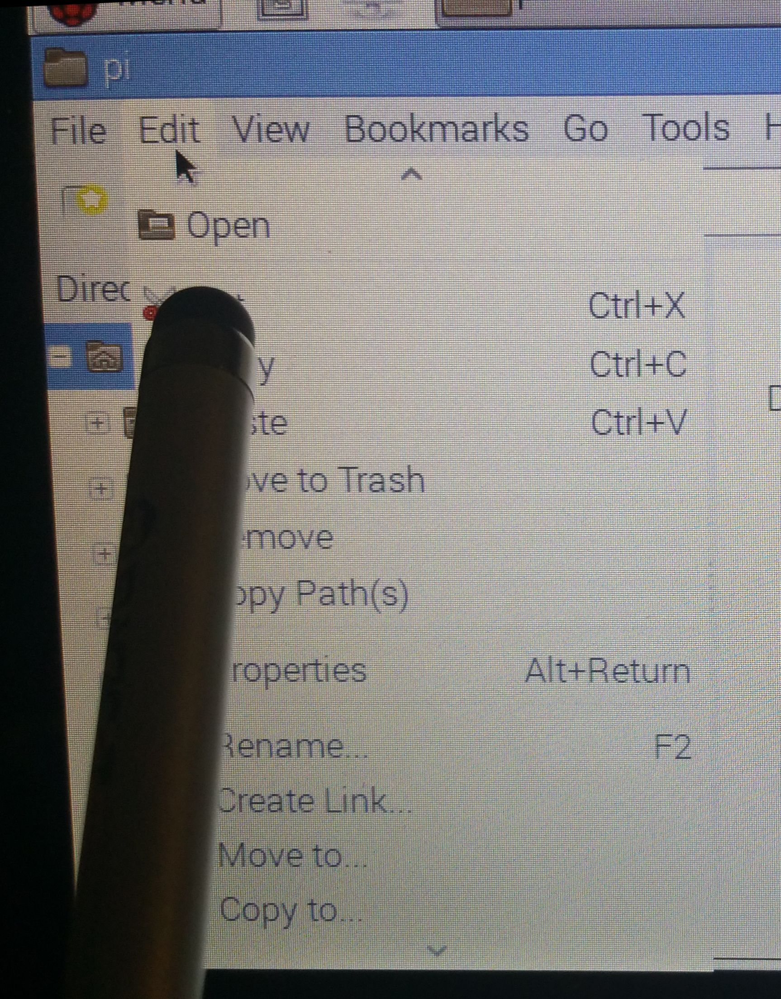
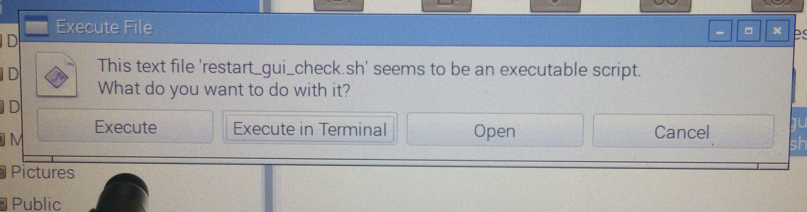
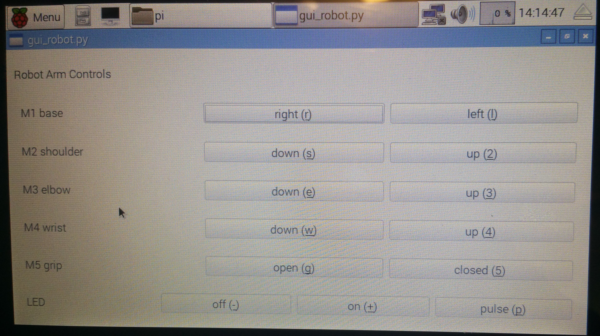

2016 ANL Open House
###################

On 2016-05-21, Argonne National Laboratory [#]_ hosted an 
open house.  [#]_ 
The EPICS Edge Robot Arm was presented as a control system demonstration.  

Connecting it all up
********************

1. unplug the 5V transformer from 120 VAC power
2. plug the 5V transformer micro USB cable into the lower board 
   (the touch screen board), that board will supply power to the RasPi
3. plug the RoboArm USB cable into the RasPi
4. plug the joystick/controller USB cable into the RasPi

   
   RasPi, joystick, and RoboArm connected

Power On
********

The power transformer is plugged in to the outlet
strip to power up the RasPi.

The RoboArm USB interface has a power switch on the top
of the battery box.  Turn it on while the RasPi is starting.

   
   RasPi starting up after power is applied.

Once the RasPi starts, the IOC should start within a minute (or two).
The RoboArm LED (behind the grip) will turn on at the end of the IOC
startup file, signalling the IOC has started.

   
   The RoboArm LED is ON indicating the EPICS IOC has started.

If plugged in, the joystick should be able to operate.
Test the LED to verify.

.. _start.GUI.manually:

Start the GUI (manually)
************************

On first logging in after startup, the GUI is supposed to 
start automatically, about a minute after the IOC starts.
This is not working now.

Follow these steps to start the GUI from the touch screen.

   
   Step 1. start the File Manager on the touch screen

   
   Step 2. touch *restart_gui_check.sh*

   
   Step 3. touch *Edit* menu

   
   Step 4. touch *Open* item

   
   Step 5. press *Execute* button

Python Touch Screen GUI
***********************

While the touch screen is multi-touch (the screen can indicate more
than one touch at a time), the Python GUI is not prepared to handle
more than one button press at a time.

   
   Python Touch Screen GUI

Joystick Controls
*****************

The Robot Arm can be moved using a joystick or game controller
plugged in to a USB port on the IOC.  An EPICS *substitutions* file
should be prepared for each new type of joystick, to map the buttons
to the EPICS database actions.

The IOC is prepared for the joystick to be hot-swapped 
(unplugged, changed to a different one, ....

If you plug in a second recognized joystick, it will also work.
If it is the same type as an existing plugged-in joystick, the 
second will be ignored unless you create additional EPICS support.
But, who would ever do that?

.. toctree::
   :maxdepth: 1
   :glob:
   
   joysticks/* 

IOC Preparation
***************

A Raspberry Pi 3 (RasPi3) was setup with linux raspbian jessie 
operating system on a 16 GB micro SD card (an 8GB card would be 
fine just as well).  Once the 
system was setup and operations verified, the SD card
was imaged for use on several systems.  The units chosen for
the demo were Raspberry Pi 2 (which can run the same software 
and architecture build).

For the open house demo system, a 7" touch screen 
was configured so that the computer will run without 
keyboard or mouse.

EPICS base release 3.14.12.5 [#]_ 
was installed (and built) in ``/usr/local/epics/base``.
The EPICS Edge Robot Arm project software [#]_ 
was installed using a ``git clone`` command in the
`/usr/local/epics`` directory.  To facilitate 
configuration already in the project,  a soft link
was made as follows::

    cd /usr/local/epics
    ln -s epicsEdgeRoboArm/edgeRoboArmIOC  ./edgeRoboArmIOC
    cd edgeRoboArmIOC/support
    make release
    make

Various packages were installed 
(using ``sudo apt-get install <package>``) 
so that the build was successful.
Among these:  

.. hlist::
   :columns: 3
   
   * re2c
   * libreadline
   * libreadline-dev
   * libusb-1.0.0
   * libusb-1.0.0-dev

The IOC *must* be run by the root user to communicate through the USB port.  
The Python GUI can be run by the *pi* user 
(it communicates with the EPICS IOC using EPICS Channel Access protocol).
Both of these are started by cron tasks.
Each cron task checks every minute to see if its assigned process is not already 
running and that appropriate resources are available:

  * IOC: the USB from the robot is plugged in and the robot arm is powered on
  * GUI: the IOC is started 

note: The GUI task is not starting from its cron task.  
The startup script must be run manually (see :ref:`start.GUI.manually`).

--------------

.. rubric::  Footnotes
   
.. [#] http://www.anl.gov
.. [#] http://www.anl.gov/events/argonne-open-house
.. [#] http://www.aps.anl.gov/epics/base/R3-14/12.php
.. [#] https://github.com/BCDA-APS/epicsEdgeRoboArm
