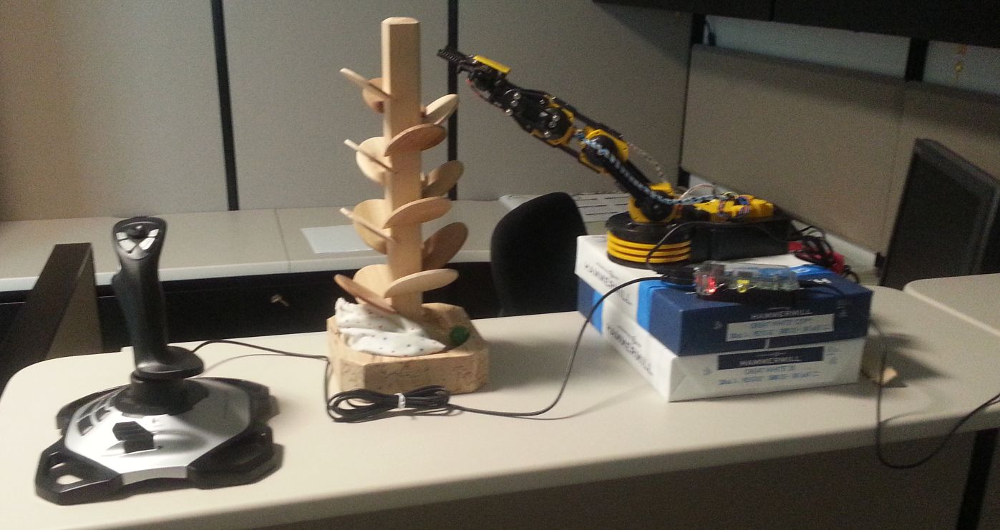
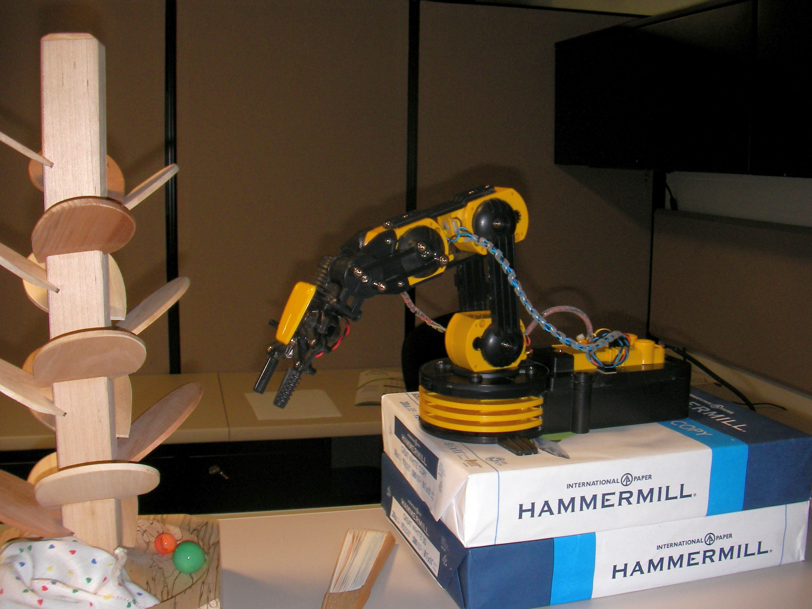
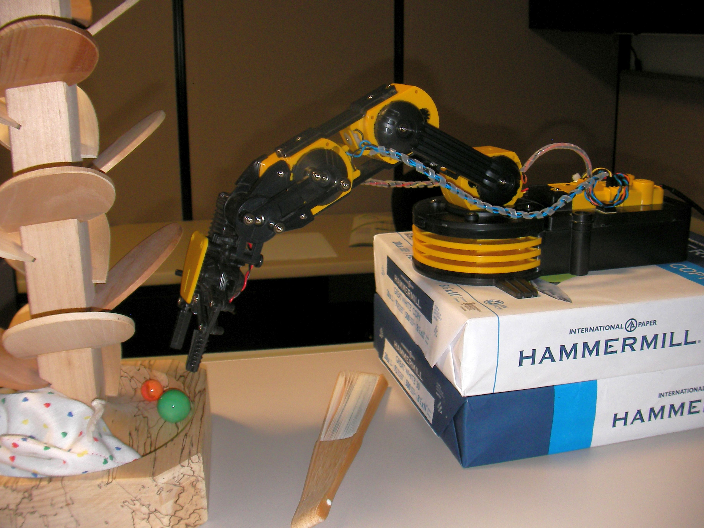
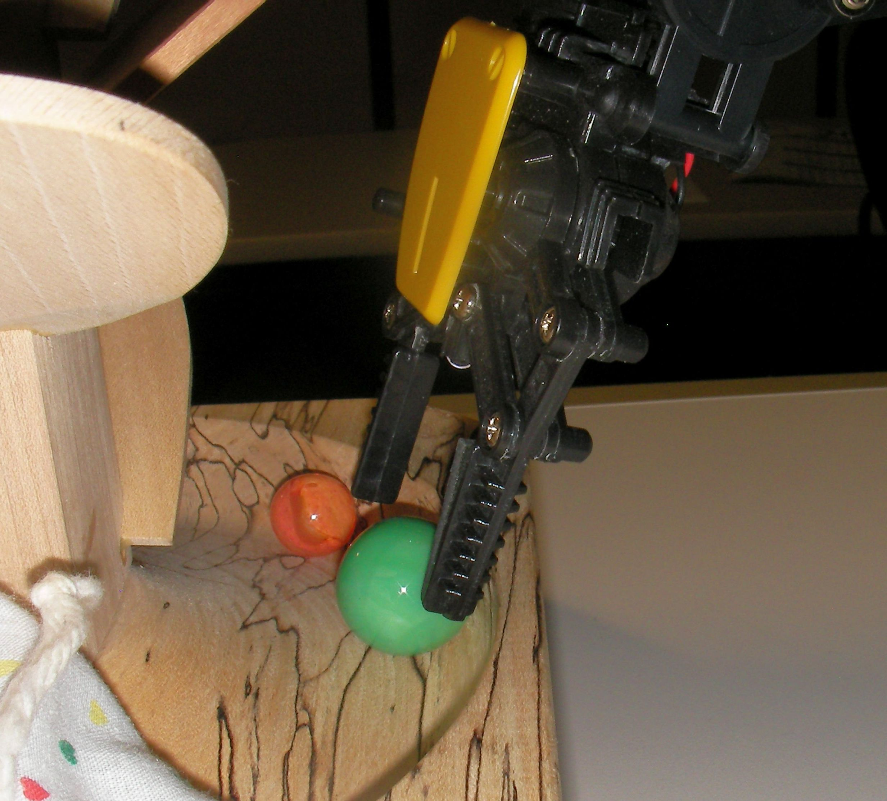
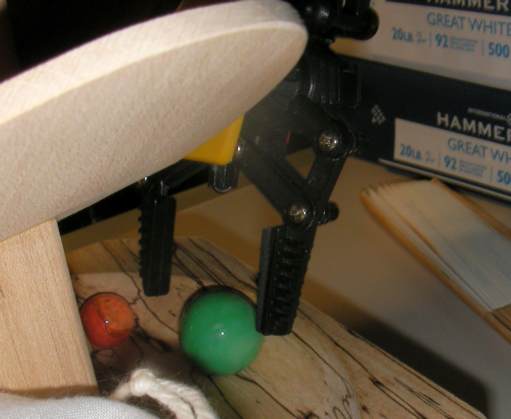
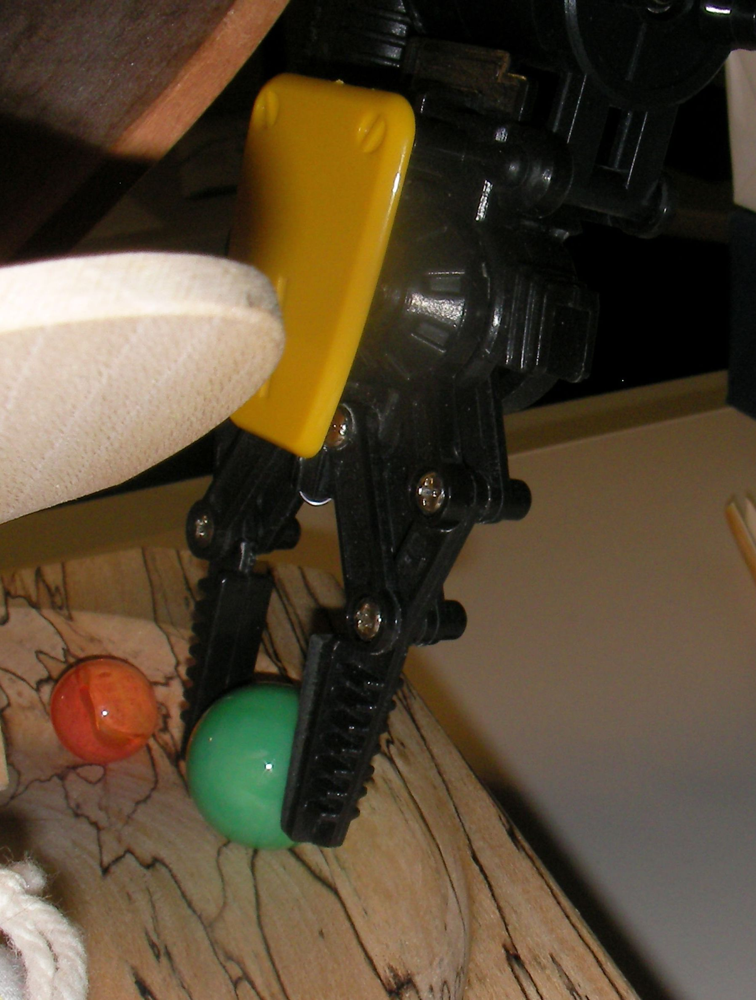
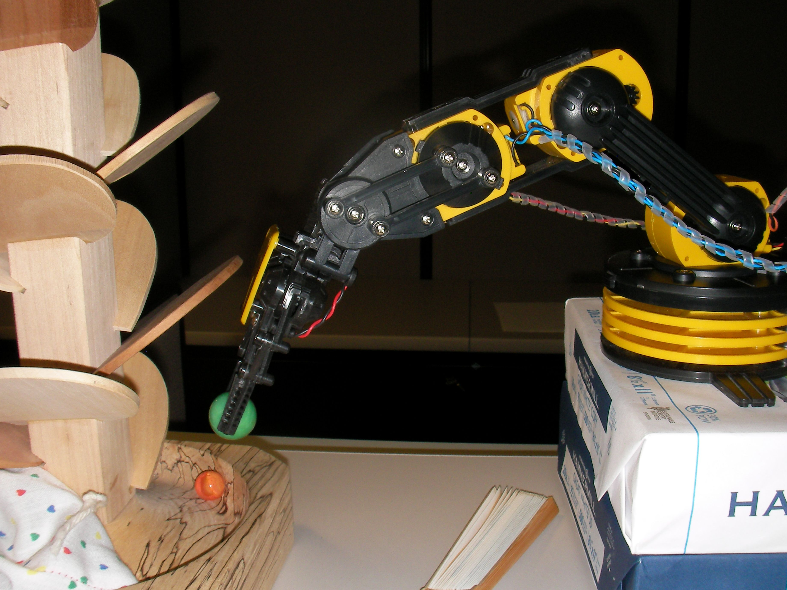
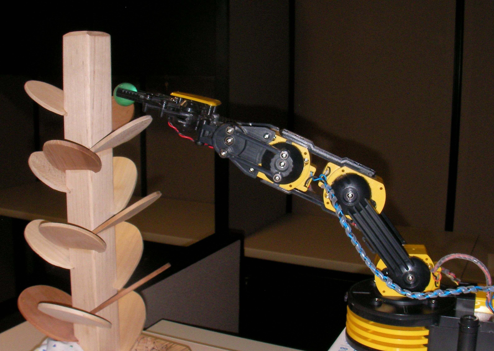
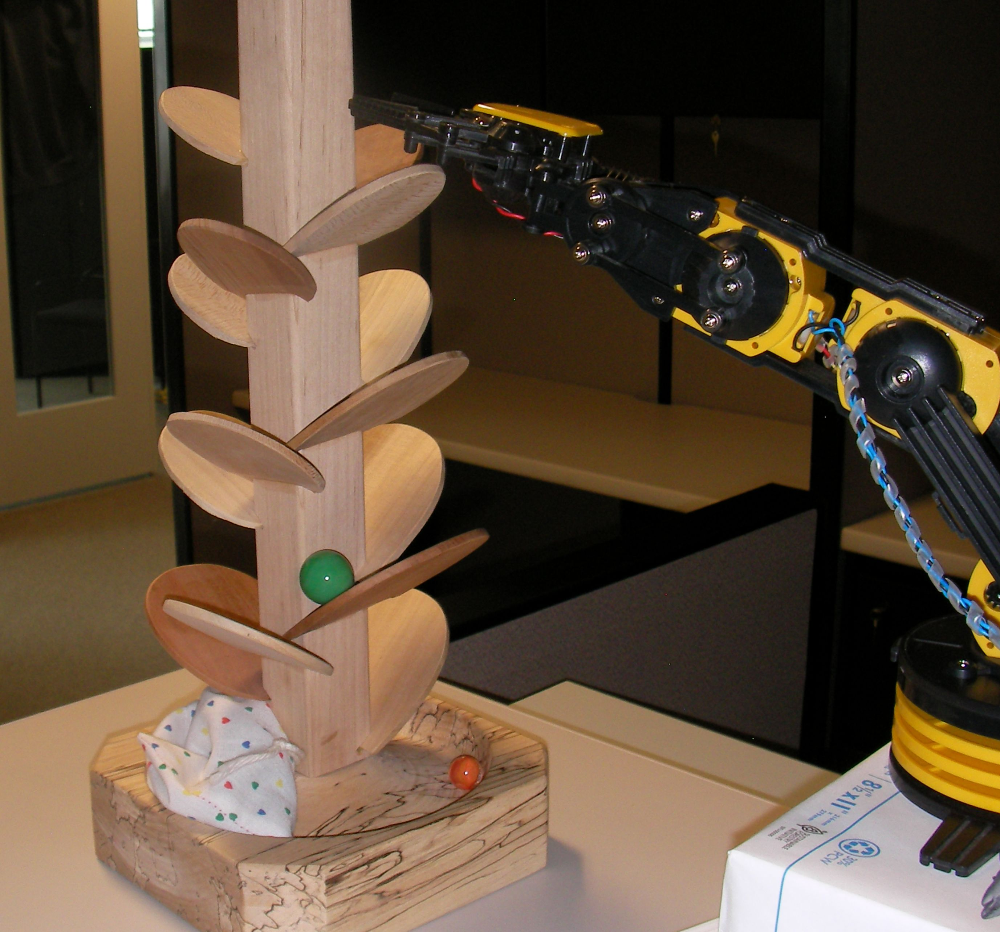

=====================================
Get the ball rolling: The Marble Tree
=====================================

The robot arm can lift small objects and move them
under visual control.  Using a joystick and some 
practice, the control can become intuitive.

A great example of the robot would be to place a ball 
in a maze, pick it up at the end and repeat.  With that 
in mind, a marble tree (wooden musical instrument and 
coffee table amusement) is ideal.  The marble tree shown 
in the pictures was purchased in Berea, KY. [#]_

Example
-------

This system uses the robot arm, a Raspberry Pi to run the IOC,
and a joystick that runs in the IOC.  No GUI is necessary.
It is useful to place the robot on a plinth so that it 
can reach top of the marble tree, as well as pick up 
the marble from the bin at the bottom.

   
   System for marble tree example

See the section :ref:`joystick` for details about the
mapping of controls on the joystick.

Once the Raspberry Pi has been connected to the joystick and robot arm
and the Linux system is started up, the EPICS IOC should start
within two minutes.  (Otherwise something is wrong.  Check all the connections.)
Keep in mind that the Raspberry Pi is very sensitive to changes in electrical
power demand.  It is best to plug everything in **before** plugging in the electrical
power to the Raspberry Pi.
 
Pulse the LED button to ensure the IOC is operating.

Step 1
++++++

   
   Move arm into place to pick up marble. 
   Be sure to clear all the wooden leaves!

   
   Address the ball. [#]_

Step 2
++++++

   
   Approach the ball with the grips open.
   It may help to turn on the LED to verify alignment.

   
   It may be needed to nudge the ball to using the base
   to pick it up with the grips. 

Step 3
++++++

   
   Grip the ball until the motor stops.

Step 4
++++++

   
   Carefully, raise the shoulder a bit, without banging the wooden leaves.
   Don't knock the ball out of the grips.
   
   Move back until the arm can clear all the leaves.

Step 5
++++++

   
   Raise and lengthen the arm to position the ball 
   at the top of the marble tree.

Step 6
++++++

   
   Open the grips to release the ball.
   Listen as the ball moves downward.

-------------------

.. [#] marble tree: http://www.berea.com/appalachian-fireside-gallery/
.. [#] http://www.barryrhodes.com/2012/01/addressing-ball.html

