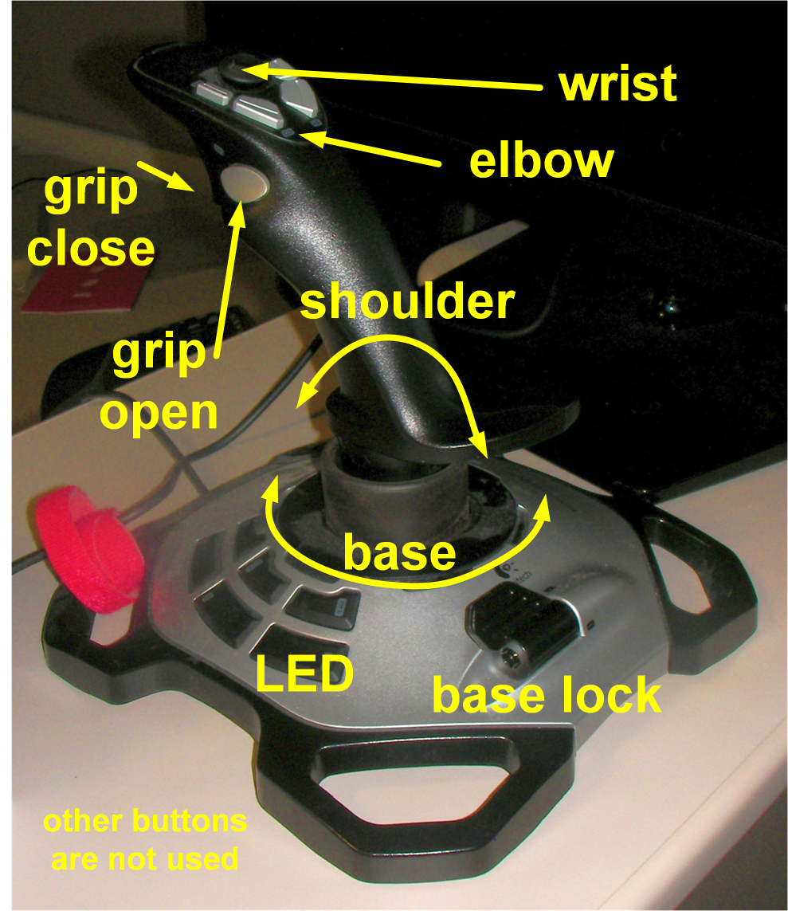

=====================================
Get the ball rolling: The Marble Tree
=====================================

The robot arm can lift small objects and move them
under visual control.  Using a joystick and some 
practice, the control can become intuitive.

A great example of the robot would be to place a ball 
in a maze, pick it up at the end and repeat.  With that 
in mind, a marble tree (wooden musical instrument and 
coffee table amusement) is ideal.  The marble tree shown 
in the pictures was purchased in Berea, KY.

Example
-------

This system uses the robot arm, a Raspberry Pi to run the IOC,
and a joystick that runs in the IOC.  No GUI is necessary.
It is useful to place the robot on a plinth so that it 
can reach top of the marble tree, as well as pick up 
the marble from the bin at the bottom.

.. figure:: ../graphics/20150513_164853.jpg
   :width: 12cm
   
   System for marble tree example

Controls
++++++++

   
   This is the joystick we will use.
   It is right-handed and has a twist action (vertical axis).  
   We'll use that for the base rotation.

========  ================================================================
button    action
========  ================================================================
trigger   close grip
thumb     open grip
twist     rotate base in same direction
lever     turns on/off base rotation (useful when trying to grasp objects)
joystick  shoulder axis: forward=down, back=up
elbow     two buttons, forward and back
wrist     knob, forward=down, back=up
========  ================================================================

The joystick buttons are described in file:
``edgeRoboArmIOC/support/usb-1-0/usbApp/Db/LogitechExtreme3DPro.in``
The actions are mapped to buttons in file:
``edgeRoboArmIOC/support/xxx-5-6/xxxApp/Db/roboArm.db``

Pulse the LED button to ensure the IOC is operating.

Step 1
++++++

   
   Move arm into place to pick up marble. 
   Be sure to clear all the wooden leaves!

   
   Move arm into place to pick up marble. 
   Be sure to clear all the wooden leaves!

Step 2
++++++

.. figure:: ../graphics/SANY0007.JPG
   :width: 12cm
   
   Approach the ball with the grips open.
   It may help to turn on the LED to verify alignment.

.. figure:: ../graphics/SANY0008.JPG
   :width: 12cm
   
   It may be needed to nudge the ball to using the base
   to pick it up with the grips. 

Step 3
++++++

   
   Grip the ball until the motor stops.

Step 4
++++++

.. figure:: ../graphics/SANY0010.JPG
   :width: 12cm
   
   Carefully, raise the shoulder a bit, without banging the wooden leaves.
   Don't knock the ball out of the grips.
   
   Move back until the arm can clear all the leaves.

Step 5
++++++

.. figure:: ../graphics/SANY0011.JPG
   :width: 12cm
   
   Raise and lengthen the arm to position the ball 
   at the top of the marble tree.

Step 6
++++++

.. figure:: ../graphics/SANY0012.JPG
   :width: 12cm
   
   Open the grips to release the ball.
   Listen as the ball moves downward.

-------------------

.. [#] marble tree: http://www.berea.com/appalachian-fireside-gallery/

